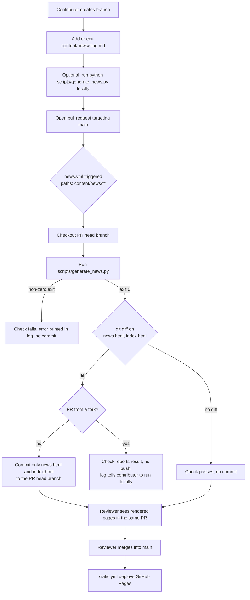

# Design Document

## Overview

News content today lives in two hand-edited places that must agree: the full article list inside `<div class="news-list">` in `news.html`, and a condensed two-item mirror inside `<div class="news-preview">` in `index.html`. The two use different markup (`article.news-article` with an `h2` versus `article.news-item` with an `h3`), so publishing one post means writing HTML twice.

This design replaces that with one Markdown file per post in a data directory, a standard-library Python generator that renders both blocks from the same parsed post, and a pull request workflow that runs the generator so a reviewer sees the rendered result. Nothing is published until a maintainer merges, and the existing GitHub Pages deploy workflow (`.github/workflows/static.yml`, which triggers on push to `main` and uploads the whole repository) publishes the merged files with no additional step (Req 9.10).

The design deliberately mirrors the publications pipeline that already exists and is tested in this repository:

| Publications pipeline | News pipeline |
| --- | --- |
| `scripts/generate_publications.py` | `scripts/generate_news.py` |
| `scripts/curated_publications.json` (data source) | `content/news/*.md` (data source) |
| `PUBLICATIONS:START` / `:END` in `publications.html` | `NEWS:START` / `:END` in `news.html`, `NEWS_PREVIEW:START` / `:END` in `index.html` |
| `inject()`, `SentinelError` | the same `inject`, moved into a shared module |
| `_escape_text`, `_escape_attr`, `_new_tab_aria_label` | the same helpers, moved into a shared module |
| `.github/workflows/sync-publications.yml` (review gated) | `.github/workflows/news.yml` (review gated) |

Two properties of the existing pipeline carry over unchanged because they are what make it safe:

1. **Escape first, then add markup.** Every text value from a post is HTML escaped before any inline conversion runs, so the only raw tags in the output are the ones the renderer itself emits (Req 2.7, 2.11). This is the same ordering that `_highlight_author` depends on in the publications generator, and its docstring already states the rule.
2. **Marker based injection, byte preserving.** `inject()` replaces only the text strictly between two sentinels and is idempotent, so a clean regeneration is a disk no-op (Req 5.1 to 5.4).

The generator uses the standard library only, makes no network call, and reads no credential (Req 1.8). A contributor needs repository collaborator access and nothing belonging to the principal investigator (Req 10.5).

### Verified starting state

The design is written against the following confirmed facts about the repository.

- `news.html` holds three articles inside `.news-list`. The August 2026 recruitment article contains 1 `h2`, 7 `p`, 4 `h3`, 1 `ul` with 5 `li`, 3 `a`, and 1 `strong`. The three anchors are an internal link to `https://geospatialcognitionlab.com` with no `target`, an external link to `https://femp.okstate.edu` carrying `target="_blank" rel="noopener noreferrer"`, and a `mailto:` link with no `target`. The single `strong` wraps an entire closing paragraph.
- `index.html` holds two `.news-item` previews. The August 2026 headline is `Recruiting a PhD Student`, which differs from the article `h2`, so that post needs `short_title`.
- Children of `.news-list` and of `.news-preview` are both indented 16 spaces, matching the 16 / 20 / 24 indentation contract the publications renderer already produces.
- `styles.css` opens with a universal `* { margin: 0; padding: 0; box-sizing: border-box; }` reset and already styles `.news-list`, `.news-article`, `.news-date`, `.news-article h2/h3/p/ul/li`, `.news-article p a`, `.news-article li a`, `.news-image`, `.news-preview`, `.news-item`, `.news-item h3/p`, and `.news-item p a`. No change to `styles.css` is required (Req 3.6).
- Neither `news.html` nor `index.html` currently contains an em dash or an en dash, so the three migrated posts pass the House_Dash_Rule check with no rewording (Req 7.7).

## Architecture

### Pipeline

```
content/news/*.md
    |
    v
discover  ->  split front matter  ->  validate metadata  ->  parse body  ->  Post
    |                                                                          |
    |                                             (repeat for every Post_File) |
    v                                                                          v
                                  order posts (Post_Month desc, Slug desc)
                                          |                    |
                                          v                    v
                                   render_news(posts)   render_preview(posts, 2)
                                          |                    |
                                          v                    v
                              inject into news.html    inject into index.html
                                          |                    |
                                          +---------+----------+
                                                    v
                                     write both files, or neither
```

Every stage before the write is a pure function over in memory values. Validation, rendering, reading, and injection all complete before the first byte is written, which is what makes the all or nothing guarantee cheap to honor (Req 7.10, 7.11).

### Generate and review flow



Pushing the generated files back to the pull request head branch fires a `synchronize` event, so `news.yml` runs a second time. That run finds no diff, adds no commit, and the loop terminates (Req 9.3).

### Decision: News_Data_Directory is `content/news/`

Post files live in `content/news/`, not in a top level `news/` directory. One post is one file, named `<slug>.md`, and that file is the only place the post's content exists (Req 1.1).

Rationale. A top level `news/` directory would sit immediately beside `news.html` in the repository root, and a contributor scanning the root would reasonably guess that `news/` is what gets served at `/news`. It is not; `news.html` is. A `content/` parent states plainly that the directory holds source content rather than served pages, and it leaves room for a future `content/people/` or similar without further churn.

Consequence to state plainly. The Pages workflow uploads the whole repository, so `content/news/*.md` will be publicly fetchable at, for example, `https://geospatialcognitionlab.com/content/news/2026-08-phd-student-opportunity.md`. This is harmless: the file contains exactly the text that the generator publishes as HTML on the same site, and it contains no credential. It is worth knowing rather than discovering by surprise. The same is already true of `scripts/curated_publications.json`.

### Decision: extract shared primitives into `scripts/site_html.py`

`inject()`, `SentinelError`, `_escape_text`, `_escape_attr`, and `_new_tab_aria_label` are needed verbatim by the news generator. There are two options.

Option A, duplicate them into `generate_news.py`. Cheapest right now, and it cannot break the publications pipeline. The cost is two copies of the subtlest code in the repository. `inject()` has an exact whitespace contract (the middle region becomes `"\n" + rendered + end_indent`, where `end_indent` is read from the END marker's own line, which is what makes it idempotent). Two copies of that contract will drift, and the copy that drifts will be the one nobody is looking at.

Option B, extract into a new module `scripts/site_html.py`, have `generate_news.py` import it, then refactor `generate_publications.py` to import it too.

This design takes Option B, with the refactor sequenced as a separate, test guarded step:

1. Create `scripts/site_html.py` holding the shared primitives, generalized where the news pipeline needs it (`inject_between()` takes the marker pair and a default indent as parameters, because news needs two different marker pairs).
2. Build `generate_news.py` on top of it, with its own tests.
3. Only then, replace the bodies in `generate_publications.py` with imports from `site_html`, keeping the existing module level names (`PUBLICATIONS_START`, `PUBLICATIONS_END`, `SentinelError`, `inject`, `_escape_text`, `_escape_attr`, `_new_tab_aria_label`) as thin aliases or wrappers so the 67 existing tests keep importing the same symbols from the same place.

The risk, stated honestly: step 3 touches working, deployed code, and the failure mode is a silently wrong `publications.html` on the next monthly sync. What makes it acceptable is that the 67 existing tests, including the Hypothesis property tests for `inject()` idempotence and structure preservation, already pin the exact behavior being moved. If the extraction changes anything observable, those tests fail. If the suite is red for any reason at the time, step 3 does not proceed; the news pipeline works fine with `site_html.py` in place and `generate_publications.py` untouched, so step 3 can be deferred without blocking anything.

`_new_tab_aria_label` moves as is, including its stripping of a trailing U+2192 arrow. News link labels carry no arrow, so the strip is a no-op there, and reusing the function keeps one accessible name convention across the site (Req 2.9).

### Decision: `scripts/generate_news.py`, standard library only

The generator is a pure functional core (discover, parse, validate, order, render, inject) plus a thin `main()` that does the file I/O and maps exceptions to exit codes. It imports only `argparse`, `dataclasses`, `html`, `os`, `pathlib`, `re`, `sys`, and `urllib.parse`. No network call, no credential, no third party dependency, so `pip install` is not needed in CI and a contributor can run it with a bare Python 3.12 (Req 1.8).

One consequence of the standard library constraint: there is no Markdown library, so the accepted body syntax is an explicitly defined subset, specified below, and anything outside it is a hard error rather than a silent literal (Req 7.8).

## Components and Interfaces

### Component 1: `scripts/site_html.py` (shared primitives)

```python
class SentinelError(ValueError): ...

def escape_text(value: str, quote: bool = False) -> str
def escape_attr(value: str) -> str
def new_tab_aria_label(label: str) -> str

def inject_between(
    html_text: str,
    rendered: str,
    start_marker: str,
    end_marker: str,
    default_indent: str,
    file_label: str = "the target file",
) -> str
```

`inject_between` is the existing `inject()` with the marker pair, the fallback indent, and the file name in the error message lifted into parameters. Its contract is unchanged and is restated here because the news pipeline depends on every clause of it:

- Locate `start_marker` and `end_marker`. Replace only the text strictly between them.
- Everything up to and including the start marker, and everything from the end marker onward, is preserved byte for byte, the marker strings included (Req 5.2).
- The middle region becomes `"\n" + rendered + end_indent`, or `"\n" + end_indent` when `rendered` is empty, where `end_indent` is the horizontal whitespace on the end marker's own line, falling back to `default_indent` if the end marker shares its line with other content.
- Because no blank padding is emitted before the end marker, any pre-existing padding collapses on the first run and never grows again. Re-running with the same `rendered` yields byte identical output (Req 5.3).
- Raise `SentinelError` naming the missing marker and the file when either marker is absent, or when the end marker precedes or overlaps the start marker (Req 5.5, 5.6).

### Component 2: `scripts/generate_news.py`

Module constants, each defined in exactly one place:

```python
NEWS_DIR      = Path(__file__).resolve().parent.parent / "content" / "news"
NEWS_PAGE     = <repo root> / "news.html"
HOME_PAGE     = <repo root> / "index.html"

PREVIEW_COUNT = 2                       # Req 4.5, 4.7

NEWS_START           = "<!-- NEWS:START -->"
NEWS_END             = "<!-- NEWS:END -->"
NEWS_PREVIEW_START   = "<!-- NEWS_PREVIEW:START -->"
NEWS_PREVIEW_END     = "<!-- NEWS_PREVIEW:END -->"

BASE_INDENT   = " " * 16                # Req 3.5
INTERNAL_HOST = "geospatialcognitionlab.com"

REQUIRED_KEYS = ("title", "date", "teaser")                 # Req 1.4
OPTIONAL_KEYS = ("short_title", "image", "image_alt")       # Req 1.5

MONTH_NAMES = ("January", "February", ..., "December")      # Req 5.7
```

`PREVIEW_COUNT` is read by `render_preview` and by nothing else, so changing the constant changes the home page on the next run with no edit to `index.html` (Req 4.7).

`MONTH_NAMES` is a hard coded tuple rather than `calendar.month_name` or `strftime("%B")`, both of which read the `LC_TIME` locale. A locale dependent month name would make output depend on the machine, which Req 5.7 forbids.

Public functions, all pure except `load_posts` (reads files) and `main`:

```python
def discover_post_files(directory: Path) -> list[tuple[str, Path]]
def split_front_matter(text: str, slug: str) -> tuple[dict[str, str], list[str], int]
def parse_front_matter(raw: dict[str, str], slug: str) -> dict[str, str]
def parse_body(lines: list[str], slug: str, first_line: int) -> tuple[Block, ...]
def build_post(slug: str, text: str) -> Post
def load_posts(directory: Path) -> tuple[Post, ...]
def order_posts(posts: Iterable[Post]) -> tuple[Post, ...]

def render_inline(raw: str) -> str
def render_news(posts: Iterable[Post]) -> str
def render_preview(posts: Iterable[Post], preview_count: int = PREVIEW_COUNT) -> str

def main(argv=None) -> int
```

`discover_post_files` globs `*.md`, sorts by slug for a deterministic parse and error reporting order, and validates each slug against `^[a-z0-9-]+$`, raising on the first violation with the file name (Req 7.6). It raises when no `.md` file is found (Req 7.9). Ordering for output does not come from this function; it comes from `order_posts` (Req 6.4).

`order_posts` sorts with a single reverse sort on `(year, month, slug)`. A reverse sort on that tuple yields Post_Month descending with Slug descending as the tiebreak, which is exactly Req 6.1 and 6.2. Both renderers consume the output of this one function, so the article order and the preview selection cannot disagree (Req 6.3).

### Component 3: front matter format

```
---
title: PhD Student Opportunity: Geospatial Cognition, Disaster Science, & Emergency Management at OSU
short_title: Recruiting a PhD Student
date: 2026-08
teaser: The lab is recruiting a funded PhD student. Read the full call on the [News page](news.html).
---
```

Rules, chosen to be simple enough that a form based CMS could write the same files later:

- The first line of the file must be exactly `---` after stripping trailing whitespace, and a later line must be exactly `---`. Anything else is an error naming the slug (Req 7.4).
- Each line between the delimiters is `key: value`, split on the **first** colon only. This matters: the recruitment post's title contains a colon, and splitting on the first colon keeps the rest of the title in the value.
- Keys are matched case sensitively against `REQUIRED_KEYS + OPTIONAL_KEYS`. Anything else is an error naming the slug and the key (Req 7.2). A duplicate key is also an error, because silently keeping the last one hides a typo.
- Values are whitespace stripped. A required key whose stripped value is empty is an error naming the slug and the field (Req 7.5).
- `date` must match `^\d{4}-(0[1-9]|1[0-2])$`. Anything else is an error naming the slug and the offending value (Req 7.3).
- Supplying `image` without a non-empty `image_alt` is an error (Req 2.6). An alt text is not optional on a content image.
- No multi line values, no quoting, no comments, no nested structures. `teaser` accepts inline markup because the existing August 2026 preview contains a link.

### Component 4: the Markdown subset and the parse pipeline

**Block level.** The body is split on blank lines into blocks. Within a block:

| Source | Block | Rendered |
| --- | --- | --- |
| A line starting with `## ` | subheading | `<h3>` |
| Every line starting with `- ` | list | one `<ul>` with one `<li>` per line, source order preserved |
| Anything else | paragraph | one `<p>`, with the block's lines joined by a single space |

A block whose first line starts with `## ` must be a single line. A block that mixes `- ` lines with non `- ` lines is an error. Consecutive `- ` lines with no blank line between them form exactly one list (Req 2.3).

**Inline level.** Three forms, and only three (Req 2.4):

| Source | Rendered |
| --- | --- |
| `[label](target)` | `<a href="target">label</a>`, plus new tab attributes when the target is external |
| `**text**` | `<strong>text</strong>` |
| `*text*` | `<em>text</em>` |

**The ordering that makes this safe.** `render_inline` escapes first, then adds markup:

```python
def render_inline(raw: str) -> str:
    out = escape_text(raw, quote=True)   # &, <, >, " become entities
    out = _LINK_RE.sub(_link_replacement, out)
    out = _STRONG_RE.sub(r"<strong>\1</strong>", out)
    out = _EM_RE.sub(r"<em>\1</em>", out)
    return out
```

This ordering works because `html.escape` does not touch `[`, `]`, `(`, `)`, or `*`, so every delimiter the inline grammar needs survives the escape untouched. It also gets link targets right for free: an `&` in a target becomes `&amp;` before the anchor is assembled, which is exactly the escaping an `href` attribute value requires. The result is that the only raw `<` in the output is one the renderer wrote (Req 2.7, 2.8, 2.11). A `<script>` typed into a post body comes out as `&lt;script&gt;`, visible text and not markup.

Note the one deliberate deviation from the publications generator: news text content is escaped with `quote=True`, so a double quote in body text becomes `&quot;`. `_escape_text` in the publications generator uses `quote=False`, which is fine for its purposes, but Req 2.7 names `"` explicitly among the characters to escape in text values. `&quot;` renders identically to `"` in a browser, and no existing news text contains a double quote, so migration fidelity is unaffected.

**Unsupported constructs.** After inline substitution, a leftover `*` or `[` means the source used an emphasis or link form that did not parse, and that is a hard error rather than literal asterisks in the published page. Stray `(` and `)` are allowed, because ordinary prose uses them and the recruitment article does exactly that around a link.

The full unsupported list, each reported with the slug and the line number (Req 7.8):

- `# ` and `### ` and deeper headings. Only `## ` is accepted, because `h1` belongs to the page and `h3` is the deepest level `styles.css` styles inside `.news-article`.
- Ordered list markers such as `1. `.
- Backticks, for inline code or fenced blocks.
- Image syntax `` in the body. Images come from the `image` front matter key so that `image_alt` can be enforced.
- Block quote markers `> `.
- Table pipes at the start of a line.
- A raw HTML tag, detected as `<` followed by a letter or `/`.
- An unmatched `**` or `*`, or an unmatched `[`.
- An em dash (U+2014) or an en dash (U+2013) anywhere in presented text, including front matter values. The error names the slug, names which character was found, quotes the offending source line, and states the fix: replace it with a comma, a colon, or the word `to` for a numeric range (Req 7.7).

The dash check and the construct check run at parse time, where the slug and the line number are in hand. Blocks therefore carry their source line number.

### Component 5: the two renderers

Both renderers consume the same ordered `Post` values, so a post cannot appear with one date on one page and another date on the other.

`render_news(posts)` emits, per post, at 16 space indent:

```html
                <article class="news-article">
                    <span class="news-date">August 2026</span>
                    <h2>...</h2>
                         <!-- only when image is set -->
                    <p>...</p>
                    <h3>...</h3>
                    <ul>
                        <li>...</li>
                    </ul>
                </article>
```

The `article` sits at 16 spaces, its children at 20, and `li` elements at 24, matching both the existing file and the publications renderer's contract (Req 3.5). Article blocks are separated by one blank line, as they are today. Element order is `span.news-date`, `h2`, optional `img`, then body blocks in source order (Req 3.1, 3.2, 3.3, 3.7). The image renders at the start of the body with a fixed attribute order of `src`, `alt`, `class` so output is byte stable (Req 2.5).

`render_preview(posts, preview_count)` takes the first `preview_count` posts from the ordered sequence and emits:

```html
                <article class="news-item">
                    <span class="news-date">August 2026</span>
                    <h3>Recruiting a PhD Student</h3>
                    <p>The lab is recruiting ... on the <a href="news.html">News page</a>.</p>
                </article>
```

The headline is `short_title` when present, otherwise `title` (Req 1.6, 4.3). The single `p` is the rendered `teaser`; the body is never emitted here (Req 4.4). Slicing an ordered sequence handles the short list case with no special branch (Req 4.6). Preview articles are not blank line separated, matching `index.html` today.

Both renderers return `""` for an empty input, which `inject_between` handles, though `main` never reaches that state because an empty directory is already an error (Req 7.9).

### Component 6: link classification

```python
def _is_external(target: str) -> bool:
    parts = urllib.parse.urlsplit(target)
    if parts.scheme not in ("http", "https"):
        return False                      # mailto:, relative, fragment
    host = (parts.hostname or "").lower()
    return host != INTERNAL_HOST and not host.endswith("." + INTERNAL_HOST)
```

An external link is an absolute `http` or `https` URL on a host other than `geospatialcognitionlab.com` or one of its subdomains. Those anchors get `target="_blank"`, `rel="noopener noreferrer"`, and an `aria-label` of `"{label}, opens in a new tab"` from the shared `new_tab_aria_label` (Req 2.9). `noopener` denies the opened page a handle on this one, and `noreferrer` keeps the referrer from leaking. Everything else, meaning `mailto:` links, relative links such as `news.html`, and links to the lab's own host, gets a bare anchor with no `target` and no `rel` (Req 2.10).

Attribute order is fixed at `href`, `target`, `rel`, `aria-label` so output is byte stable.

Applied to the recruitment article this reproduces the current markup: the `https://geospatialcognitionlab.com` link stays bare, the `mailto:` link stays bare, and the `https://femp.okstate.edu` link keeps `target="_blank" rel="noopener noreferrer"`.

**One intentional difference from the live page.** The FEMP anchor currently has no `aria-label`; the generated one will have `aria-label="femp.okstate.edu, opens in a new tab"`. Req 2.9 requires it and it matches the convention the publications links already follow. Req 8.2 asks the migration to reproduce text content, heading levels, list items, emphasis, and link targets, and Req 8.4 asks it to preserve the existing link attributes, so adding an accessible name is additive rather than a fidelity failure. It is called out here so the migration diff is not a surprise during review.

### Component 7: sentinels and the one time manual edit

`news.html` becomes:

```html
            <div class="news-list">
                <!-- NEWS:START -->
                <!-- NEWS:END -->
            </div>
```

`index.html` becomes:

```html
            <div class="news-preview">
                <!-- NEWS_PREVIEW:START -->
                <!-- NEWS_PREVIEW:END -->
            </div>
```

Both marker pairs are inserted by a single manual edit that also deletes the hand written article markup, exactly as was done for `publications.html`. Both sentinel lines sit at 16 space indent, so `end_indent` picked up from the end marker's line matches `BASE_INDENT` and the fallback never fires in normal operation.

The surrounding structure stays hand maintained and untouched: the `.news-list` and `.news-preview` wrappers, the `<h2>Recent News</h2>` heading in `index.html`, and the "View All News" button below the preview. None of those are article markup, so Req 8.5 is satisfied once the three articles and two previews are inside the sentinel regions.

### Component 8: `main()` and the atomic write

```
1. posts = load_posts(NEWS_DIR)            # discovery + parse + validate, raises on any problem
2. ordered = order_posts(posts)
3. news_block    = render_news(ordered)
4. preview_block = render_preview(ordered, PREVIEW_COUNT)
5. read news.html and index.html as bytes  # both, before any write
6. news_out    = inject_between(news_text,  news_block,    NEWS_START, NEWS_END, ...)
7. preview_out = inject_between(index_text, preview_block, NEWS_PREVIEW_START, NEWS_PREVIEW_END, ...)
8. compute which targets actually differ
9. write only the differing targets, each via a temp file plus os.replace
```

One invocation of `main` produces both the article list and the home page preview from the same parsed post set, so the two pages cannot fall out of sync (Req 1.3).

Steps 1 through 7 are the entire validation surface, and none of them writes anything. Any failure returns a non-zero exit with both pages byte identical to how they started (Req 7.10, 7.12). Because both HTML files are read and injected in memory before step 9, a missing sentinel in `index.html` cannot leave `news.html` already rewritten (Req 7.11).

Each individual write is atomic: the new bytes go to a temp file in the same directory and are moved into place with `os.replace`. A target whose bytes are unchanged is not written at all, so a clean regeneration touches no file and produces a zero byte repository diff (Req 5.4).

The residual risk, stated rather than glossed over: two `os.replace` calls are two operations, so a filesystem failure (permissions, disk full) between them could leave `news.html` updated and `index.html` not. The window is small because all parsing, rendering, and injection are already done, but it is not zero. When the second write fails, `main` prints an error naming both the file that was already updated and the file that was not, and exits non-zero, so the condition is visible rather than silent. In CI the fix is to rerun the workflow, which is idempotent.

Exit codes: `0` on success, whether or not anything was written; `1` on any validation, sentinel, read, or write failure, with the reason on stderr.

CLI surface, mirroring the publications generator so both scripts feel the same:

```
python scripts/generate_news.py
    [--news-dir content/news] [--news-file news.html] [--home-file index.html]
    [--preview-count 2] [--check]
```

`--check` renders and compares without writing, exiting non-zero if the pages are out of date. It is useful locally and as a fork PR check.

### Component 9: `.github/workflows/news.yml`

```yaml
name: Generate news pages

on:
  pull_request:
    branches: [main]
    paths: ["content/news/**"]      # Req 9.1
  workflow_dispatch: {}             # Req 9.7

concurrency:
  group: news-${{ github.event.pull_request.number || github.ref }}
  cancel-in-progress: false         # queue, do not cancel (Req 9.9)

permissions:
  contents: write                   # push to the PR head branch
  pull-requests: write              # Req 9.8, built-in token only, no PAT

jobs:
  generate:
    runs-on: ubuntu-latest
    steps:
      - uses: actions/checkout@v4
        with:
          ref: ${{ github.event.pull_request.head.ref || github.ref }}
          repository: ${{ github.event.pull_request.head.repo.full_name || github.repository }}
      - uses: actions/setup-python@v5
        with:
          python-version: "3.12"
      # no pip install: the generator is standard library only
      - name: Generate news pages
        run: python scripts/generate_news.py        # non-zero fails the check (Req 9.5)
      - name: Detect changes
        id: diff
        run: |
          if git diff --quiet -- news.html index.html; then
            echo "changed=false" >> "$GITHUB_OUTPUT"
          else
            echo "changed=true" >> "$GITHUB_OUTPUT"
          fi
      - name: Commit generated pages
        if: steps.diff.outputs.changed == 'true' && <not a fork>
        run: |
          git config user.name  "github-actions[bot]"
          git config user.email "41898282+github-actions[bot]@users.noreply.github.com"
          git add news.html index.html                # Req 9.4, only these two paths
          git commit -m "chore: regenerate news pages from content/news"
          git push
      - name: Fork notice
        if: steps.diff.outputs.changed == 'true' && <is a fork>
        run: |
          echo "This pull request comes from a fork, so the generated pages"
          echo "cannot be pushed. Run 'python scripts/generate_news.py' locally"
          echo "and commit news.html and index.html to this branch."
          exit 1
```

Fork detection is `github.event.pull_request.head.repo.full_name != github.repository`.

Design points worth stating:

- **Why `pull_request` and not `pull_request_target`.** `pull_request_target` would give the job a write token while running code from the pull request head, which is the standard path to a compromised repository. `pull_request` is used instead, and the accepted consequence is that fork pull requests get a read only token and cannot be pushed to. Req 9.6 already anticipates this: the fork path runs the generator as a check and logs that the contributor must run it locally. Since contributors are collaborators working on branches inside the repository (per the scope notes), the fork path is the exception, not the norm.
- **The commit does not loop.** Pushing to the PR head fires `synchronize`, so the workflow runs again, finds no diff, and stops (Req 9.3).
- **Manual dispatch.** On `workflow_dispatch` the job regenerates on the dispatched ref and commits back to it, except when the dispatched ref is the default branch, in which case it reports the diff in the log and fails the check rather than pushing to `main`. That keeps the review gate that Req 9.2 exists to provide.
- **Interaction with `static.yml`.** Nothing in this workflow deploys. Merging the pull request pushes to `main`, which triggers the existing Pages workflow, which uploads the whole repository including the regenerated pages (Req 9.10).
- **No secret.** Only the built in `GITHUB_TOKEN` is used (Req 9.8).

### Component 10: migration

Three post files, one per existing article (Req 8.1).

`content/news/2026-08-phd-student-opportunity.md`:

```
---
title: PhD Student Opportunity: Geospatial Cognition, Disaster Science, & Emergency Management at Oklahoma State University
short_title: Recruiting a PhD Student
date: 2026-08
teaser: The lab is recruiting a funded, in-residence PhD student for a Spring or Fall 2027 start. Read the full call on the [News page](news.html).
---

We are actively recruiting a funded, in-residence PhD student to join the Geospatial Cognition Lab at Oklahoma State University in Stillwater for a Spring or Fall 2027 start.

## About the Program & Lab

The student will pursue a PhD in Fire & Emergency Management Administration (FEMP) while conducting geographic and spatial-cognition research through the Geospatial Cognition Lab. ...

FEMP is a unique, multidisciplinary program: a small collaborative group of in-residence graduate students in Stillwater, alongside a network of over 130 remote MS and PhD students from across North America and abroad. ...

## Qualifications & Preferred Skills

Applicants with backgrounds in geography, emergency management, disaster science, psychology, human factors, sociology, or related fields are encouraged to apply. ... Additional preferred skills include:

- Spatial analysis and a baseline understanding of GIS
- Familiarity with mixed-methods research, experimental design, or survey methodology
- Interest in spatial cognition, navigation, human factors, or emergency-response research
- Proficiency in R and/or Python, particularly for data visualization or analysis
- Strong written and verbal communication skills

## Funding

This position comes with guaranteed funding for the first two years. ...

## How to Apply

Interested students should review the Geospatial Cognition Lab ([geospatialcognitionlab.com](https://geospatialcognitionlab.com)) and FEMP program ([femp.okstate.edu](https://femp.okstate.edu)) websites to see if our work and program structure align with their academic goals. To apply, please email Dr. Chelsie McWhorter at [Chelsie.McWhorter@okstate.edu](mailto:Chelsie.McWhorter@okstate.edu) with your CV, unofficial transcripts, a brief statement regarding your research interests, and preferred start semester (Spring 2027 or Fall 2027). Applications will be reviewed on a rolling basis until the position is filled.

**For priority consideration for a Spring 2027 start, materials should be received by October 1, 2026.**
```

Paragraph text is elided above with `...` for readability; the real file carries the current wording verbatim.

How each feature of that article maps:

| Current markup | Source form |
| --- | --- |
| `h2` with `&amp;` | `title` front matter value containing a literal `&`, escaped at render |
| `Recruiting a PhD Student` preview headline | `short_title`, required here because it differs from the `h2` |
| 4 `h3` section headings | 4 `## ` lines |
| 7 `p` elements | 7 paragraph blocks |
| `ul` with 5 `li` | 5 consecutive `- ` lines |
| Internal lab link, no `target` | `[geospatialcognitionlab.com](https://geospatialcognitionlab.com)`, classified internal |
| External FEMP link with `target` and `rel` | `[femp.okstate.edu](https://femp.okstate.edu)`, classified external |
| `mailto:` link, no `target` | `[Chelsie.McWhorter@okstate.edu](mailto:Chelsie.McWhorter@okstate.edu)`, non http scheme |
| `strong` wrapping an entire paragraph | a paragraph block that is entirely `**...**` |
| Literal parentheses around two links | plain `(` and `)` in the source, left alone by the inline grammar |

`content/news/2026-02-a-lab-is-born.md`:

```
---
title: A Lab is Born (Insert Dramatic Music Here)
short_title: A Lab is Born
date: 2026-02
teaser: The Geospatial Cognition Lab officially launches at Oklahoma State University!
---

The Geospatial Cognition Lab officially launches at Oklahoma State University! After years of research on firefighter navigation, emergency wayfinding, and spatial decision-making, we're thrilled to have a home base for this work. Stay tuned for research updates, student spotlights, and the occasional pet photo.
```

`content/news/2025-07-mcwhorter-joins-osu.md`:

```
---
title: Dr. McWhorter Joins OSU
date: 2025-07
teaser: Dr. Chelsie McWhorter joins Oklahoma State University as an Assistant Professor in the Fire & Emergency Management Administration program.
---

Dr. Chelsie McWhorter joins Oklahoma State University as an Assistant Professor in the Fire & Emergency Management Administration program. ...
```

This post has no `short_title` because it is not previewed today, which exercises the `title` fallback path (Req 1.6). It still needs a `teaser`, since `teaser` is required for every post (Req 1.4); the value above is unused at the current post count and becomes visible only if `PREVIEW_COUNT` is raised.

Ordering check. Sorted by `(year, month, slug)` descending: `2026-08` first, then `2026-02`, then `2025-07`. That is the current page order, and the two most recent are the two currently previewed (Req 6.1, 8.3).

**Is the subset sufficient?** For all three articles, yes. Every element in the current markup maps to a defined construct, and no article uses an ordered list, a nested list, a table, a block quote, inline code, a heading deeper than `h3`, or an inline image.

**What is not expressible**, so nobody discovers it mid post: ordered and nested lists; more than one image per post, or an image anywhere except the start of the body; a caption or `figure` wrapper; inline `code`; block quotes; tables; arbitrary raw HTML; a link whose target contains a literal `)`; a link label containing a literal `]`; and a `date` more precise than a month. Each of these is a hard error with a line number rather than a silent misrendering, and each is a small, additive change to the subset if a post ever needs it.

### Component 11: documentation deliverables

`HOW-TO-UPDATE.txt` gets its "ADDING NEWS POSTS" section rewritten (Req 10.1, 10.2, 10.3, 10.6, 10.7):

1. Every accepted front matter key, which are required, and the `YYYY-MM` date format.
2. The body syntax table, plus the explicit list of unsupported constructs.
3. The contributor procedure end to end (Req 10.2): create a branch, copy `content/news/_template.md` to `content/news/<slug>.md`, edit, commit, open a pull request against `main`, wait for the check to commit the regenerated pages, request review, and let the reviewer merge.
4. The local command, `python scripts/generate_news.py`, and the `--check` variant.
5. Explicit removal of the current step 5, "Don't forget to update the Recent News section on index.html too! (Just the 2 most recent items)", replaced by a note that the home page preview is generated (Req 10.6).
6. A dash warning (Req 10.7): Microsoft Word and Google Docs silently convert a typed hyphen into an em dash, which the generator rejects. How to turn it off (Word: File, Options, Proofing, AutoCorrect Options, AutoFormat As You Type, clear "Hyphens with dash"; Google Docs: Tools, Preferences, clear "Automatic substitution"). How to fix a draft that already has one: find and replace the character with a comma, a colon, or the word `to` for a numeric range. Paste as plain text when moving text from a word processor.
7. A note that a contributor needs collaborator access and no credential of the principal investigator (Req 10.5).

`content/news/_template.md` is the copyable template (Req 10.4). It begins with an underscore, and `discover_post_files` skips names starting with `_`, so the template is never rendered as a post. This exclusion is part of the discovery contract, not an afterthought.

## Data Models

```python
Block = tuple[str, int, object]
# ("paragraph",  line_number, str)              raw source text, lines joined by a space
# ("subheading", line_number, str)              raw source text after "## "
# ("list",       line_number, tuple[str, ...])  one raw source string per item, source order


@dataclass(frozen=True)
class Post:
    slug: str                 # file name without .md, [a-z0-9-]+ (Req 1.7)
    title: str                # raw, unescaped (Req 1.4)
    short_title: str          # "" when absent; renderer falls back to title (Req 1.6)
    year: int                 # from date YYYY-MM
    month: int                # 1..12
    teaser: str               # raw, unescaped, may contain inline markup (Req 4.4)
    image: str                # "" when absent (Req 1.5)
    image_alt: str            # non-empty whenever image is non-empty (Req 2.6)
    blocks: tuple[Block, ...] # source order (Req 3.7)

    @property
    def display_month(self) -> str:
        return f"{MONTH_NAMES[self.month - 1]} {self.year}"

    @property
    def order_key(self) -> tuple[int, int, str]:
        return (self.year, self.month, self.slug)

    @property
    def headline(self) -> str:
        return self.short_title or self.title
```

Design notes on the model:

- **Frozen and tuple valued.** `Post` is frozen and `blocks` is a tuple of tuples, so a `Post` is hashable and two `Post` values compare by value. That makes test assertions direct (`assert parse(text) == expected_post`) and makes it structurally impossible for a renderer to mutate a post another renderer will read.
- **Stores raw text, not HTML.** Every text field holds the unescaped source. Escaping and inline conversion happen once, in `render_inline`, at render time. Storing escaped text would invite double escaping, and storing HTML would mean the model could carry markup that no renderer emitted, which is precisely the property the escape ordering exists to guarantee.
- **`year` and `month` as separate integers**, not a `date` and not a string. Integers sort correctly with no parsing at sort time, they cannot carry a spurious day component, and `display_month` derives the label from `MONTH_NAMES` with no locale involvement.
- **Blocks carry a line number.** Not needed for rendering, needed for error messages: Req 7.8 requires a line number for an unsupported construct and Req 7.7 requires quoting the offending source line. Carrying it in the block means the reporting code does not have to rediscover it.
- **`short_title` and `image` use `""` rather than `None`** for absence, so `self.short_title or self.title` is the whole fallback and there is no `Optional` to unpack at every use site.

## Error Handling

Every error is a refusal to write. There is no partial success, no best effort rendering, and no warning that a reviewer might skim past. The generator either produces both pages or leaves both untouched (Req 7.10, 7.11, 7.12).

### Exception hierarchy

```python
class PostError(ValueError):
    """A Post_File is invalid. Carries the slug and, where known, a line number."""

# from scripts/site_html.py
class SentinelError(ValueError):
    """A target file's sentinel pair is missing or out of order."""
```

`PostError` is raised by discovery, front matter parsing, and body parsing. Its message is always constructed to name the post first, so a reviewer scanning a failed check sees which file to open before reading anything else. `SentinelError` is raised only by `inject_between`. `main` catches `PostError`, `SentinelError`, `OSError`, and `UnicodeDecodeError`, prints one line to stderr, and returns `1`.

### Failure catalog

| Condition | Message shape | Req |
| --- | --- | --- |
| No `.md` file in the data directory | `ERROR: no post files found in content/news` | 7.9 |
| Slug has a character outside `[a-z0-9-]` | `ERROR: <file>: slug must contain only lowercase letters, digits, and hyphens` | 7.6 |
| Opening or closing `---` missing | `ERROR: <slug>: front matter must open and close with a line containing only ---` | 7.4 |
| Required key missing | `ERROR: <slug>: missing required front matter key 'teaser'` | 7.1 |
| Unrecognized key | `ERROR: <slug>: unrecognized front matter key 'author'; accepted keys are ...` | 7.2 |
| Duplicate key | `ERROR: <slug>: duplicate front matter key 'title'` | 7.2 |
| Required value empty after stripping | `ERROR: <slug>: front matter key 'title' must not be empty` | 7.5 |
| `date` malformed | `ERROR: <slug>: date '2026-13' must match YYYY-MM with a month from 01 to 12` | 7.3 |
| `image` without `image_alt` | `ERROR: <slug>: 'image' requires a non-empty 'image_alt' for the alt attribute` | 2.6 |
| Em dash or en dash present | `ERROR: <slug> line 12: found an em dash (U+2014) in "...quoted line...". Replace it with a comma, a colon, or the word "to" for a numeric range.` | 7.7 |
| Unsupported construct | `ERROR: <slug> line 7: unsupported Markdown construct 'ordered list marker'. Accepted body syntax: paragraphs, '## ' subheadings, '- ' list items, [label](target), **strong**, *em*.` | 7.8 |
| Sentinel missing | `ERROR: sentinel/injection failure: missing start sentinel '<!-- NEWS:START -->' in news.html` | 5.5 |
| End sentinel before start | `ERROR: sentinel/injection failure: end sentinel appears before the start sentinel in index.html` | 5.6 |
| Cannot read a target file | `ERROR: cannot read news.html: <reason>` | 7.12 |
| Cannot write a target file | `ERROR: cannot write index.html: <reason>. news.html was already updated; rerun after fixing.` | 7.11 |

Reporting order is deterministic: posts are validated in slug order, and the first failure stops the run. Reporting only the first error is a deliberate choice over accumulating all of them, because the alternative invites a long list where the second entry is a cascade of the first. The slug and line number in the message are enough to fix one problem per iteration, and the check reruns in seconds.

The dash rule message is the one place where the error text is prescriptive. That is intentional: a contributor pasting from a word processor will hit it, will not know why a character they cannot see is being rejected, and needs the fix in the message rather than in a document they have not opened (Req 7.7, 10.7).

## Correctness Properties

A property is a characteristic or behavior that should hold true across all valid executions of a system, essentially a formal statement about what the system should do. Properties serve as the bridge between human readable specifications and machine verifiable correctness guarantees.

The generator's core is pure, which makes property based testing a good fit here: parsing, ordering, rendering, and injection are total functions from values to values, with a large input space (arbitrary post text, arbitrary post sets, arbitrary host documents) and clear universal rules. The properties below were derived from the acceptance criteria prework and consolidated to remove redundancy, so each one carries unique validation value.

### Property 1: Post file round trip

*For any* set of valid posts serialized into a data directory, loading that directory returns exactly one `Post` per file, with each `Post` field equal to the value written for it and the slug equal to the file stem, and with no file becoming two posts and no post being dropped.

**Validates: Requirements 1.2, 1.4, 1.5**

### Property 2: Body parse and render order fidelity

*For any* sequence of body blocks serialized into a Post_Body, parsing that body returns the same sequence of block kinds and payloads in the same order, and rendering that post emits the corresponding elements in that same order, with each subheading yielding exactly one `h3`, each paragraph exactly one `p`, and each list exactly one `ul` whose `li` elements preserve item order.

**Validates: Requirements 2.1, 2.2, 2.3, 3.7**

### Property 3: Escape then markup safety

*For any* post text, including text containing `&`, `<`, `>`, `"`, raw HTML tags, and preexisting entity strings, the set of HTML tag names appearing in either rendered block is a subset of the renderer's own tag vocabulary, and every one of those characters taken from the post appears in the output only in escaped form and never as active markup.

**Validates: Requirements 2.7, 2.8, 2.11**

### Property 4: Link attribute classification

*For any* link target, the rendered anchor carries `target="_blank"`, `rel="noopener noreferrer"`, and an `aria-label` equal to the link label followed by `, opens in a new tab` if and only if the target is an absolute `http` or `https` URL whose host is neither `geospatialcognitionlab.com` nor one of its subdomains; every other target, including `mailto:`, relative, and self host targets, yields an anchor carrying neither a `target` nor a `rel` attribute.

**Validates: Requirements 2.9, 2.10**

### Property 5: News page structure

*For any* set of posts, the rendered news block contains exactly one `article` with class `news-article` per post, and in each one the first child is a `span` with class `news-date` whose text is the post's Display_Month, followed by an `h2` holding the post title, followed, only when the post supplies an image, by exactly one `img` with class `news-image` positioned before every body element.

**Validates: Requirements 2.5, 3.1, 3.2, 3.3, 3.4**

### Property 6: Indentation contract

*For any* set of posts, every line of the rendered news block is indented to exactly one of the expected depths, with each `article` element at 16 spaces, each of its direct children at 20 spaces, and each `li` element at 24 spaces.

**Validates: Requirements 3.5**

### Property 7: Class vocabulary is already styled

*For any* set of posts, every value the renderers emit in a `class` attribute is drawn from the fixed set of class names already present in `styles.css`, so no rendered output can require a stylesheet change.

**Validates: Requirements 3.6**

### Property 8: Preview structure and headline fallback

*For any* set of posts, the rendered preview block contains one `article` with class `news-item` per previewed post, and in each one the first child is a `span` with class `news-date` holding the Display_Month, followed by an `h3` whose text is the post's `short_title` when that value is non-empty and the post's `title` otherwise, followed by exactly one `p` holding the rendered teaser and containing no text drawn from the Post_Body.

**Validates: Requirements 1.6, 4.1, 4.2, 4.3, 4.4**

### Property 9: Preview selection

*For any* set of posts and *for any* preview count, the previewed posts are exactly the first `min(preview_count, number of posts)` posts of the ordered sequence, in that order.

**Validates: Requirements 4.5, 4.6, 4.7**

### Property 10: Injection preserves structure and is idempotent

*For any* host document containing a well ordered sentinel pair and *for any* rendered block, injection leaves every byte up to and including the start marker and every byte from the end marker onward unchanged, the marker strings themselves included, and injecting the same rendered block into the result again yields byte identical output.

**Validates: Requirements 5.1, 5.2, 5.3, 5.4**

### Property 11: Sentinel failure detection

*For any* host document from which a required marker has been removed, or in which the end marker precedes the start marker, injection raises an error naming the offending marker and the file, and a full run in that state exits non zero having left both target files byte identical.

**Validates: Requirements 5.5, 5.6**

### Property 12: Determinism under enumeration order

*For any* set of posts and *for any* permutation of that set, the rendered news block and the rendered preview block are byte identical to those produced from any other permutation, and no output depends on the wall clock or the process locale.

**Validates: Requirements 5.7, 6.4**

### Property 13: Ordering

*For any* set of posts, the ordered sequence is non increasing on the key `(year, month, slug)`, so posts run from most recent Post_Month to least recent with ties broken by descending slug, and the previewed posts are a prefix of that same sequence.

**Validates: Requirements 6.1, 6.2, 6.3**

### Property 14: Validation rejection identifies the post and the fault

*For any* valid post mutated by exactly one of the defined faults, namely removing a required front matter key, adding an unrecognized key, duplicating a key, emptying a required value to whitespace, corrupting the `date` value, removing a front matter delimiter, supplying an `image` without a non-empty `image_alt`, or using a file name outside `[a-z0-9-]`, the run raises an error whose message names the post's slug, or the file name in the slug case, together with the specific offending key, value, or field.

**Validates: Requirements 1.7, 2.6, 7.1, 7.2, 7.3, 7.4, 7.5, 7.6**

### Property 15: Dash rule error content

*For any* post and *for any* position in any of its presented text values at which an em dash or an en dash is inserted, the run fails with an error that names the slug, names which of the two characters was found, quotes the source line containing it, and states that the contributor replaces it with a comma, a colon, or the word `to` for a numeric range.

**Validates: Requirements 7.7**

### Property 16: Unsupported construct line number

*For any* valid body and *for any* line index at which an unsupported Markdown construct is inserted, the run fails with an error naming the slug and the one based line number of the inserted line.

**Validates: Requirements 7.8**

### Property 17: Fail closed and all or nothing write

*For any* set of post files, if the run exits non zero then both the News_Page and the Home_Page are byte identical to their contents before the run, and if the run exits zero then both files reflect the same set of posts, so a run never updates one target without the other.

**Validates: Requirements 7.10, 7.11, 7.12**

## Testing Strategy

Tests use `pytest` with `hypothesis`, the framework already configured in this repository (`pytest.ini`, `requirements.txt`, `tests/`). The existing suite is 67 passing tests covering the publications pipeline; the tests below are added to it, and the existing tests are what make the `site_html.py` extraction safe to perform.

Because the generator is standard library only and makes no network call, every test runs offline with no mocking of external services. File touching tests use `tmp_path` fixtures holding copies of the two HTML pages, so no test can modify the real `news.html` or `index.html`.

### Layout

| File | Covers |
| --- | --- |
| `tests/news_strategies.py` | Hypothesis strategies for inline text, body blocks, posts, post sets, link targets, and host documents with sentinels |
| `tests/test_news_frontmatter.py` | Front matter round trip, every metadata validation failure (Properties 1, 14) |
| `tests/test_news_body.py` | Block parsing, inline conversion, unsupported constructs, dash rule (Properties 2, 15, 16) |
| `tests/test_news_escaping.py` | Escape then markup safety against hostile input (Property 3) |
| `tests/test_news_links.py` | External versus internal classification and attributes (Property 4) |
| `tests/test_news_render.py` | News page structure, indentation, class vocabulary (Properties 5, 6, 7) |
| `tests/test_news_preview.py` | Preview structure, headline fallback, selection count (Properties 8, 9) |
| `tests/test_news_inject.py` | Shared injection reuse, idempotence, sentinel failures (Properties 10, 11) |
| `tests/test_news_order.py` | Ordering and determinism under permutation (Properties 12, 13) |
| `tests/test_news_pipeline.py` | End to end `main()`, fail closed, all or nothing writes (Property 17) |
| `tests/test_news_migration.py` | Migration fidelity against the pre-migration snapshots (Req 8.1 to 8.5) |
| `tests/test_news_docs.py` | Documentation drift checks and template validity (Req 10.1, 10.3, 10.4, 10.6) |

### Configuration for property tests

- Each of the 17 properties is implemented by a **single** property based test.
- Each runs a minimum of 100 iterations, via `@settings(max_examples=100)` where the default is lower or where a deadline needs relaxing for the file touching cases.
- Each test carries a comment tag naming the property it implements, in the format used by the existing suite:

```python
# Feature: news-authoring-workflow, Property 3 (escape then markup safety)
# For any post text, including text containing &, <, >, ", raw HTML tags, and
# preexisting entity strings, the set of HTML tag names appearing in either
# rendered block is a subset of the renderer's own tag vocabulary ...
```

- Hypothesis is used as the property engine. No property framework is written from scratch.

### Generator design notes

The strategies decide how much of the input space each property really explores, so a few are worth pinning down:

- **Hostile text strategy.** For Property 3 the text alphabet deliberately includes `&`, `<`, `>`, `"`, `'`, and whole injected strings such as `<script>`, `</p>`, `&amp;`, and `&lt;`, because escaping bugs hide in text that already looks escaped. This is the opposite of the existing `tests/strategies.py`, which draws from an HTML safe alphabet precisely so escaping is a no-op and ordering assertions can compare rendered text against source strings. Both alphabets are needed, for different properties.
- **Month pool.** For Property 13 the year and month are drawn from small pools so that Post_Month ties actually occur and the slug tiebreak is exercised. Drawing months uniformly across a wide range would make ties vanishingly rare and the tie branch untested.
- **Dash and construct injection.** Properties 15 and 16 build a valid post, then insert exactly one fault at a drawn position. Drawing the position is what catches off by one line numbers, which is the specific defect the line number requirement exists to prevent.
- **Host documents.** Property 10 generates the prefix and suffix around the sentinel pair, including cases where the end marker line carries unusual indentation, so the `end_indent` fallback path is reached rather than assumed.

### Unit and example tests

The property tests cover the universal rules; these concrete tests cover the rest, and are kept few on purpose since the properties handle input breadth.

- A run against an empty data directory exits non zero with both pages unchanged (Req 7.9).
- A run against the three migrated posts updates both pages, and a second run writes nothing (Req 5.4).
- A simulated `OSError` on the second target write produces a non zero exit and an error naming both the file that was written and the one that was not (Req 7.11).
- An import allowlist check asserts `generate_news.py` pulls in nothing outside the standard library, which is how the no network and no credential claim is kept true over time (Req 1.8).
- All 12 month numbers map to the expected Display_Month strings with no locale dependency (Req 5.7).
- The template post file parses cleanly as a post and is excluded from discovery (Req 10.4).

### Migration fidelity check

This is the test that decides whether the migration is trustworthy, so it is specific rather than a snapshot equality assertion, which would fail on the intended `aria-label` addition and teach everyone to ignore it.

The current `news.html` and `index.html` news regions are captured as fixtures before the manual sentinel edit. The test renders the three migrated posts and compares, per article:

- the extracted text content, with whitespace normalized;
- the heading levels and their order, expecting 1 `h2` and 4 `h3` for the recruitment article;
- the list items, expecting one `ul` with 5 `li` in the original order;
- the emphasis spans, expecting the single `strong` to wrap the whole closing paragraph;
- the element census, expecting 1 `h2`, 7 `p`, 4 `h3`, 1 `ul`, 5 `li`, 3 `a`, and 1 `strong`;
- every link target, and the attribute set on each anchor: no `target` and no `rel` on the internal lab link and on the `mailto:` link, and `target="_blank" rel="noopener noreferrer"` on the FEMP link.

The single expected difference is asserted explicitly rather than tolerated: the FEMP anchor gains `aria-label="femp.okstate.edu, opens in a new tab"`. Writing it as a positive assertion means that if the escaping or classification logic later changes what that attribute contains, the test fails.

The preview fidelity check compares the two rendered `.news-item` blocks against the captured `index.html` block for headline text, Display_Month, and teaser text, including the `news.html` link inside the August 2026 teaser (Req 8.3).

A final check asserts that after migration `news.html` contains no `news-article` string outside its sentinel region and `index.html` contains no `news-item` string outside its sentinel region (Req 8.5).

### Workflow verification

The Sync_Workflow cannot be meaningfully property tested: it is GitHub Actions configuration and external service behavior, it does not vary with input, and 100 runs would find nothing that 1 run does not. It is verified by inspection plus one live exercise.

By inspection: the `pull_request` trigger with the `content/news/**` paths filter (Req 9.1); the `add-paths` equivalent limiting the commit to `news.html` and `index.html` (Req 9.4); `workflow_dispatch` present (Req 9.7); `permissions` declaring exactly `contents: write` and `pull-requests: write`, with no secret referenced other than `GITHUB_TOKEN` (Req 9.8, 10.5); the `concurrency` group keyed per pull request with `cancel-in-progress: false` (Req 9.9); and the use of `pull_request` rather than `pull_request_target`.

By live exercise: one manual dispatch dry run on a scratch branch, and one real pull request that adds a post, confirming the bot commit appears with the regenerated pages (Req 9.2), that a rerun on the unchanged branch adds no commit (Req 9.3), that a deliberately malformed post fails the check with the generator error visible in the log and no commit (Req 9.5), and that merging triggers the existing Pages deployment with no further step (Req 9.10). The fork path (Req 9.6) is verified by inspecting the fork condition and the logged instruction, since contributors work on in repository branches by design.
