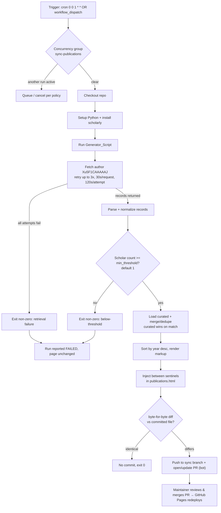

# Design Document

## Overview

This feature adds three capabilities to the existing Geospatial Cognition Lab static site (plain HTML/CSS/JS on GitHub Pages, custom domain `geospatialcognitionlab.com` via `CNAME`):

1. **PhD Recruitment Announcement**: a single news item on `news.html` that both announces the funded PhD opening and carries the complete recruitment call inline (Requirements 1, 2).
2. **Homepage Recent News sync**: a condensed mirror of the recruitment announcement placed at the top of the "Recent News" preview on `index.html`, keeping the homepage consistent with the news page per `HOW-TO-UPDATE.txt`.
3. **Automated Publication Sync**: a scheduled GitHub Actions workflow that pulls the lab's publications from Google Scholar and regenerates the `.publications-list` on `publications.html`, with strong safeguards so a blocked or empty fetch never degrades the live page (Requirements 3, 4, 5). Generation runs as a pipeline: **fetch Scholar → normalize → threshold-guard on the Scholar count → merge with a small curated list of hand-authored entries (dedupe, curated wins) → render**, so the two hand-entered publications are always preserved with their original wording. The pipeline ends by **proposing** the regenerated file via a pull request that the maintainer reviews and merges, and it never commits directly to the default branch, so nothing goes live without human review.

A fourth, cross-cutting concern was added after launch: **site-wide outbound link and markup conventions** (Requirement 6). Every hand-authored page now writes ampersands as entities, opens external links in a new tab with a safe `rel` value, and avoids em and en dashes in presented text. See "Component 6" below.

The parts have very different characters. Parts 1 and 2 are **hand-authored static content edits**: no build step, no runtime logic. Part 3 is an **automated data-transformation pipeline** with clear input (Scholar records) and output (deterministic HTML), which is where the engineering risk and the testable logic live. Part 4 is a set of authoring conventions enforced by review rather than by code.

### Guiding constraints

- **No build system.** The site is served as-is. Any tooling (the Generator_Script) runs in CI, not in the visitor's browser and not as a site dependency. The committed `.html` files remain the source of truth and stay hand-editable (Req 5.4).
- **Google Scholar is hostile to automation.** There is no official API, and Scholar actively serves CAPTCHAs and IP-blocks scrapers. The sync is therefore explicitly **best-effort**, and every failure mode defaults to "leave the last good page untouched" (Requirements 3.9, 3.10, 5.1 to 5.7).
- **Determinism.** Regeneration must be byte-stable so that an unchanged Scholar profile produces zero diff and therefore zero commits (Requirements 3.5, 3.6). Every rendering decision added later (author emphasis, link attributes) is a pure function of its inputs so this invariant still holds.

### Research summary: fetching from Google Scholar

Approaches considered for obtaining publication data:

| Approach | Cost | Reliability | Fit |
| --- | --- | --- | --- |
| **`scholarly` Python library** (chosen) | Free | Best-effort; can be blocked/CAPTCHA'd | Good for a zero-budget academic site; pure-Python, runs in Actions |
| SerpAPI (Google Scholar Author API) | Paid subscription | High, stable | Overkill/cost-prohibitive for a hobby/academic site |
| Manual BibTeX / CSV export from Scholar | Free | 100% reliable but fully manual | This is the documented fallback, not the automation |

The `scholarly` library scrapes the public Scholar profile and returns structured records. It is fragile by nature: Google may block the CI runner's IP, and there is no SLA. The design does **not** try to defeat blocking heroically; instead it treats blocking as an expected, non-fatal outcome and preserves the Last_Good_Version. This matches the user's decision that manual editing is the accepted fallback. `scholarly` supports optional proxy configuration (e.g., free rotating proxies via its `FreeProxies`/`ScraperAPI` hooks); the design leaves proxy use as an optional, off-by-default configuration knob because free proxies are themselves unreliable and paid proxies reintroduce cost.

Sources consulted for approach selection: the `scholarly` project documentation and Google Scholar's lack of a public API are well established; content was rephrased for compliance with licensing restrictions.

### Requirements coverage map

| Requirement | Addressed by |
| --- | --- |
| 1.1 to 1.5 (announcement placement/format) | News_Item authoring in `news.html` (Components §"News page edit") |
| 2.1 to 2.12 (full call content) | Content mapping table + markup skeleton (Components §"Recruitment content mapping") |
| 3.1 to 3.12 (sync, generation, review gate) | Sync_Workflow + Generator_Script (Architecture, Components) |
| 3.13 to 3.17 (author emphasis, new-tab links, curated preservation) | Generator_Script render stage (Component 4, stage 5) + curated merge (Data Models) |
| 4.1 to 4.5 (schedule/manual/concurrency) | Workflow triggers + concurrency group (Components §"Workflow triggers") |
| 5.1 to 5.7 (failure handling/fallback) | Guard sequence + non-destructive PR rule (Error Handling) |
| 6.1 to 6.7 (site-wide link and markup conventions) | Component 6 (site-wide link, entity, and dash conventions) |

## Architecture

### System context

The site is static files in a Git repository published by GitHub Pages. Two subsystems are added:

1. **Static content** (`news.html`, `index.html`, and the site-wide link/entity pass across all pages): edited by hand, no runtime component.
2. **Publication sync pipeline**: lives entirely inside the repository and runs in GitHub Actions:
   - `Sync_Workflow` (`.github/workflows/sync-publications.yml`): orchestration, scheduling, concurrency, and opening/updating a review pull request.
   - `Generator_Script` (`scripts/generate_publications.py`): fetch + transform + marker-based injection.
   - `publications.html`: carries HTML-comment **sentinels** around the `.publications-list` inner content so regeneration can replace only that region.



### Key architectural decisions

- **CI-side generation, not client-side.** GitHub Pages cannot run server code and the browser cannot fetch Scholar (CORS + blocking). A scheduled Action is the only place the fetch can live. (Req 3.1, 3.8)
- **Marker-based partial injection over full-file templating.** Rather than re-emitting the entire `publications.html` from a template (which risks drifting the navbar/footer/meta over time), the Generator_Script replaces only the text between two sentinel comments inside `.publications-list`. Everything outside the sentinels is preserved byte-for-byte. This directly satisfies Req 3.7 and keeps the file hand-editable (Req 5.4). It requires a **one-time manual edit** to `publications.html` to insert the sentinels.
- **Presentation decisions live in the renderer, not in the data.** Author emphasis and the new-tab link attributes are applied by the Generator_Script at render time rather than stored in `curated_publications.json`. Two reasons: the `authors` field is HTML-escaped before it is emitted, so stored markup would render as visible text; and any publication a future Scholar sync adds inherits the same treatment with no manual editing. (Req 3.13, 3.15)
- **Non-destructive by default.** The workflow never writes to the default branch directly. A pull request is proposed only after a positive threshold check AND a real diff; it pushes the regenerated file to a dedicated sync branch and opens/updates a PR against the default branch. Any fetch failure or below-threshold result exits non-zero and proposes nothing, leaving the Last_Good_Version intact. (Req 3.9, 3.10, 5.1, 5.2, 5.5)
- **Review-gated publishing.** Because changes land only via a pull request, a human merge is required before anything is published, so the default-branch page is never modified except by a maintainer merging the PR. This also reduces the security surface: the elevated token is used only to push a branch and open/update a PR (not to publish), and every change is human-approved before it goes live.
- **Determinism for zero-noise proposals.** Rendering is a pure function of the normalized record list, with stable ordering and fixed formatting, so an unchanged profile yields an identical file and no diff, and therefore no PR. (Req 3.5, 3.6)

### Sentinel scheme

`publications.html` is edited once so that `.publications-list` looks like:

```html
<div class="publications-list">
    <!-- PUBLICATIONS:START -->
    ... generated .pub-year blocks ...
    <!-- PUBLICATIONS:END -->
</div>
```

The Generator_Script locates the two sentinel comments and replaces the text strictly between them. The `<div class="publications-list">` open/close tags, and everything before `START` and after `END`, are never touched. If either sentinel is missing, the script aborts with an error (treated as a run failure) rather than guessing, which protects a hand-edited file that lacks markers.

## Components and Interfaces

### Component 1: News page edit (`news.html`)

A new Recruitment_Announcement is inserted as the **first** `<article class="news-article">` inside `.news-list`, above the existing "A Lab is Born" item (Req 1.3). It uses the site's standard news markup (`.news-date` span + heading + content), matching sibling items (Req 1.2). The `.news-date` is set to a full-month-name + four-digit-year value that is the most recent on the page (Req 1.4, 1.5), for example a February 2026 or later value that is at or after the current newest ("February 2026").

Because the recruitment call is long-form, the single `<article>` uses internal structure beyond a bare paragraph while staying within the existing class conventions:

- The article heading (`<h2>`) carries the announcement title.
- Sub-sections within the call use `<h3>` subheadings (About the Program & Lab, Qualifications & Preferred Skills, Funding, How to Apply).
- Qualifications/preferred skills render as a `<ul>`.
- Email renders as a `mailto:` link; external program links render as normal `<a>` links (and per Component 6 they carry the new-tab attributes).

No new CSS classes are required; `.news-article h3`, `ul`, and `a` inherit existing styles. The long-form article did need three small presentation additions to `styles.css`, all scoped to existing selectors:

- `.news-article h3` gets a **2rem top margin** so the subheadings in the recruitment article have breathing room between sections.
- `.news-article ul` and `.news-article li` get explicit padding and type styling, because the global `* { margin: 0; padding: 0 }` reset strips the browser default list indent, which would otherwise leave the bullets flush against the text column.
- Link colors are pinned to the site palette instead of the default browser blue: `--accent` on the light card backgrounds, and cream (`--bg-main`) plus an underline inside the dark olive homepage section, because `--accent` does not meet contrast against olive.

### Component 2: Recruitment content mapping (Requirement 2)

The user-supplied final text maps into the article as follows. This table is the authoritative content-to-markup contract.

| Content block | Markup | Requirements |
| --- | --- | --- |
| Title: "PhD Student Opportunity: Geospatial Cognition, Disaster Science, & Emergency Management at Oklahoma State University" | `<h2>` | 1.1, 2.2 |
| Intro: actively recruiting a funded, in-residence PhD student to join the lab at OSU Stillwater for Spring or Fall 2027 | `<p>` | 2.1, 2.2, 2.3 |
| "About the Program & Lab": FEMP PhD, research through the lab, not a traditional Geography PhD, current research (firefighter navigation, disorientation, spatial decision making), field data/surveys/spatial analysis | `<h3>` + `<p>`(s) | 2.2, 2.4 |
| FEMP multidisciplinary description: small in-residence Stillwater cohort, 130+ remote MS/PhD network, live hybrid (in-person + Zoom) format | `<p>` | 2.4 |
| "Qualifications & Preferred Skills": eligible backgrounds; **master's degree required**; research experience preferred; the five preferred-skill bullets | `<h3>` + `<p>` + `<ul><li>x5</li></ul>` | 2.5 |
| "Funding": guaranteed funding for the first two years; anticipated TA and externally funded support, as final text with no placeholder | `<h3>` + `<p>` | 2.6, 2.7 |
| "How to Apply": review lab + FEMP sites; email Dr. McWhorter with CV, unofficial transcripts, brief (one to two paragraph) research-interest statement, preferred start semester (Spring 2027 / Fall 2027) | `<h3>` + `<p>` + list of 4 materials | 2.8 |
| Email address `Chelsie.McWhorter@okstate.edu` | `<a href="mailto:Chelsie.McWhorter@okstate.edu">` | 2.9, 2.10 |
| Lab site `geospatialcognitionlab.com` and FEMP site `femp.okstate.edu` | `<a href>` links resolving to those addresses | 2.12 |
| Rolling review; priority by October 1, 2026 for Spring 2027 | `<p>` (priority line emphasized) | 2.11 |

Content-integrity notes:
- **Verbatim text.** The supplied call text is used as given; only structural markup is added around it.
- **Funding statement (2.6, 2.7).** The funding paragraph uses the exact "guaranteed funding for the first two years" phrasing. An early draft wrapped the remaining, not-yet-confirmed specifics in a bracketed, visually distinct marker so the maintainer could find and replace them later. Those specifics were resolved, the placeholder was **removed**, and the two-year guarantee plus the anticipated TA and externally funded support now stand as final text. There is no bracketed placeholder in the article, and the design does not invent specifics.
- **`mailto:` behavior (2.10).** A plain `mailto:` with the recipient pre-filled is sufficient; the browser/OS opens the default mail client with the "to" field populated. No subject/body is required by the requirement, so none is imposed. A `mailto:` link is not an External_Link and stays in the same tab (Req 6.4).

### Component 3: Homepage Recent News sync (`index.html`)

`index.html` shows the two most recent items in `.news-preview` using the **condensed** `<article class="news-item">` markup (`.news-date` + `<h3>` + one-line `<p>`), which differs from the full `.news-article` markup on the news page. To keep the homepage consistent with `HOW-TO-UPDATE.txt` step 5, a condensed recruitment entry is added as the **first** of the two shown, and the current oldest of the two ("Dr. McWhorter Joins OSU") drops off. Result after edit:

1. `news-item`: PhD recruitment (condensed one-liner, links to `news.html`), the newest
2. `news-item`: "A Lab is Born"

The condensed entry's `<p>` is a single-sentence teaser (e.g., "The lab is recruiting a funded, in-residence PhD student for Spring/Fall 2027; read the full call.") with the full detail living only in the news-page article. This is a manual edit, mirroring the manual news-page edit; there is no automation coupling the two.

### Component 4: Generator_Script (`scripts/generate_publications.py`)

Pure-Python script, invoked by the workflow. Responsibilities and interface:

```
generate_publications.py
  --author-id   Xu5F1CAAAAAJ           # Scholar user id (Req 3.2)
  --html-file   publications.html       # target file with sentinels
  --min-threshold 1                     # below → failure (Req 5.5, configurable)
  --max-retries 3                       # Req 3.2, 5.6
  --request-timeout 30                  # per-request seconds (Req 5.7)
  --attempt-timeout 120                 # per-attempt seconds (Req 3.2)
  --highlight-author McWhorter          # surname bolded in author lists;
                                        # "" disables (Req 3.13, 3.14)

Exit codes:
  0  success (committed-or-identical decided by caller via diff)
  0  identical (no change needed)          -> workflow makes no commit (Req 3.6)
  non-zero  retrieval failure after retries (Req 3.9, 5.1, 5.3)
  non-zero  below-threshold / zero records (Req 3.10, 5.5)
  non-zero  sentinels missing / write error
```

Internal stages:

1. **Fetch** (`fetch_publications(author_id)`): use `scholarly` to look up the author by id, `fill()` the profile, and retrieve each publication's bib fields. Wrap in a retry loop: up to 3 attempts (Req 3.2/5.6); each individual network request bounded to 30s (Req 5.7); each attempt bounded to 120s overall (Req 3.2). All attempts exhausted raises `RetrievalError`.
2. **Normalize** (`normalize(records) -> list[Publication]`): map raw `scholarly` bib dicts into the internal `Publication` model (see Data Models), deriving venue string and link with the DOI/pub_url fallback rules.
3. **Guard** (`check_threshold(pubs, min_threshold)`): operates on the **Scholar-fetched** count; if `len(pubs) < min_threshold` (covers zero, Req 3.10) it raises `BelowThresholdError`. This runs **before** the curated merge, so a blocked/empty fetch never falls back to only the curated entries.
4. **Load curated + merge/dedupe** (`load_curated() -> list[Publication]`, then `merge(curated, pubs) -> list[Publication]`): load the hand-entered records from `scripts/curated_publications.json`, then take the union of curated and Scholar-derived records, deduplicated by a normalized key (case-insensitive, whitespace/punctuation-normalized title; DOI equality when both have one). On a duplicate match the **curated entry wins** (its hand-authored venue/wording is kept). This stage runs only after the threshold guard has passed (Req 3.3, 3.17, 5.4).
5. **Render** (`render_list(pubs, highlight_author) -> str`): group by year, sort years descending (Req 3.4), and within a year keep a stable deterministic order (year desc, then title asc as a tiebreak; the undated bucket sorts last). Emit `.pub-year`/`.publication`/`.pub-authors`/`.pub-title`/`.pub-venue`/`.pub-link` markup matching the existing pattern (Req 3.3). Output is a pure function of the normalized list plus the `highlight_author` value (determinism for Req 3.6). Two pure helpers shape the emitted markup:
   - **`_highlight_author(escaped_authors, surname)`** wraps every whole-word, case-sensitive occurrence of `surname` in `<strong>`, using `\bSurname\b` with `re.escape`, so "McWhorter, C." matches while a longer name merely containing the surname as a substring does not. An empty surname returns the input unchanged, which is how `--highlight-author ""` disables emphasis (Req 3.14). The module constant `HIGHLIGHT_AUTHOR = "McWhorter"` supplies the default.

     **Ordering rationale (the critical design point).** The helper runs **after** `_escape_text()`, never before. The `authors` field is HTML-escaped, so bolding cannot be stored in `curated_publications.json`: a literal `<strong>` there would be escaped into visible text rather than markup. Applying the emphasis post-escape is also what keeps it injection-safe, because every `&`, `<`, and `>` from the source data has already become a character entity and the only raw tags in the rendered `.pub-authors` content are the `<strong>` pairs the renderer itself adds. As a side benefit, publications that a future Scholar sync adds automatically inherit the emphasis with no manual editing (Req 3.13).
   - **`_new_tab_aria_label(link_label)`** derives the accessible name for the outbound link. The visible label carries a decorative trailing arrow (U+2192, e.g. `"DOI →"`) that a screen reader would otherwise read aloud, so the arrow and surrounding whitespace are stripped and `", opens in a new tab"` is appended: `"DOI →"` becomes `"DOI, opens in a new tab"`. A label with no arrow is handled the same way, and a degenerate label (empty or arrow-only) yields just `"opens in a new tab"` (Req 3.16). The result is plain text and the caller attribute-escapes it.

   The `.pub-link` anchor emits its attributes in a **fixed order**: `href`, `class`, `target="_blank"`, `rel="noopener noreferrer"`, `aria-label`. `rel="noopener noreferrer"` is a security requirement, not decoration: `noopener` denies the opened page any handle back on this one (tab-nabbing) and `noreferrer` keeps the referrer from leaking. The fixed order is deliberate so the output stays byte-stable and an unchanged profile still produces zero diff (Req 3.15, 3.5, 3.6).
6. **Inject** (`inject(html, rendered)`): find `<!-- PUBLICATIONS:START -->` and `<!-- PUBLICATIONS:END -->`; replace the content strictly between them; preserve all other bytes (Req 3.7). A missing sentinel raises `SentinelError`.
7. **Write-if-different**: compute new file bytes; the workflow (not the script) decides commit via git diff, but the script only overwrites the file when bytes differ, so a clean regeneration is a no-op on disk.

### Component 5: Sync_Workflow (`.github/workflows/sync-publications.yml`)

Responsibilities: scheduling, manual trigger, concurrency, running the script, and opening/updating a review pull request.

- **Triggers** (Req 4.1, 4.2):
  ```yaml
  on:
    schedule:
      - cron: "0 0 1 * *"      # 1st of month, 00:00 UTC (Req 4.1)
    workflow_dispatch: {}       # manual on-demand (Req 4.2)
  ```
  Manual and scheduled runs execute the identical job (Req 4.3).
- **Concurrency** (Req 4.4):
  ```yaml
  concurrency:
    group: sync-publications
    cancel-in-progress: false   # queue rather than overlap
  ```
  Ensures at most one PR-proposing run at a time.
- **Permissions**: `contents: write` AND `pull-requests: write` so the job can push a branch and open a PR via the built-in `GITHUB_TOKEN` (no PAT needed). The `pull-requests: write` scope is required specifically to open/update the PR through the built-in token.
- **Steps**: checkout → setup Python → `pip install scholarly` → run Generator_Script → **if the script succeeded AND `publications.html` changed**, create or update a review pull request: push the change to a fixed sync branch (default `auto/publications-sync`) and open a PR against the default branch if one is not already open, or update the existing one. The clean way to do this with the built-in token is the [`peter-evans/create-pull-request`](https://github.com/peter-evans/create-pull-request) action (pinned to a major version, `@v6`), which handles branch push, commit, and open-or-update-PR idempotently. Its key inputs:
  - `branch: auto/publications-sync`: the dedicated sync branch (created/updated as needed)
  - `commit-message`: the bot commit message for the regenerated file
  - `title`: the PR title ("Automated Scholar publication sync")
  - `body`: a summary noting this is an automated Google Scholar sync for maintainer review
  - `base`: the default branch to target (`main`)
  - `add-paths: publications.html`: scopes the PR to the publications file so nothing unrelated is swept in
  - `delete-branch: true`: cleans up the sync branch after the PR is merged

  The action reuses the existing open PR for `auto/publications-sync` on subsequent runs rather than opening duplicates. (An alternative is the `gh` CLI, `gh pr create`, but `peter-evans/create-pull-request` is chosen for its built-in open-or-update idempotency.) When the script fails or produces no diff, this step is skipped and no PR is created or updated.
- **Failure surfacing** (Req 3.9, 3.10, 4.5, 5.3): a non-zero script exit fails the job, so **no PR is created or updated** and `publications.html` on the default branch is untouched. The failure reason (retrieval vs below-threshold) is written to the step log and reflected in the exit path. When a PR *is* opened or updated, the maintainer is notified via GitHub's standard pull-request notifications, satisfying the review + notification requirement.
- **Required repo setting**: "Allow GitHub Actions to create and approve pull requests" must be enabled (Settings → Actions → General → Workflow permissions) for the bot to open PRs with `GITHUB_TOKEN`. Aside from the two scopes above, the repository's default token permissions can otherwise remain conservative.

### Component 6: Site-wide link, entity, and dash conventions (hand-authored HTML)

These conventions apply to every hand-authored page (Requirement 6). They are authoring rules, not code, so they are enforced by review and by a validator pass rather than by a test suite.

- **Ampersands are entities.** Every literal `&` in the HTML source is written `&amp;`, including inside `href` values (Google Fonts URLs with query separators, Scholar profile URLs), inside attribute values such as `aria-label`, and in visible text. The initial pass replaced **46** bare ampersands across the **10** html pages. Existing entities were left alone, never double-escaped (Req 6.1, 6.2).
- **Outbound links open in a new tab.** Any link whose destination resolves outside `geospatialcognitionlab.com` carries `target="_blank"` and `rel="noopener noreferrer"`. The `rel` value is a security requirement: `noopener` blocks tab-nabbing by denying the opened page a handle on the opener, and `noreferrer` prevents referrer leakage (Req 6.3).
- **Internal links stay put.** Internal and relative paths, `mailto:` links, and self-referential links to the lab domain deliberately do **not** get `target="_blank"`, so ordinary site navigation behaves normally (Req 6.4).
- **Accessible names announce the new tab.** Icon links that already carried an `aria-label` had `, opens in a new tab` appended, matching what the Generator_Script does for `.pub-link` via `_new_tab_aria_label()` (Req 6.5).
- **No em or en dashes.** Presented site text uses no em dash (U+2014) and no en dash (U+2013). Commas, colons, parentheses, and the word "to" for ranges are used instead. The site currently contains zero of either character (Req 6.6).
- **Curated venue data must pre-escape its ampersands.** Because `.pub-venue` is emitted verbatim as trusted HTML (see Data Models), any ampersand in `scripts/curated_publications.json` venue text must be written `&amp;` in the JSON itself (Req 6.7).

### Interface: PR decision

The gate is a byte-for-byte comparison of the regenerated file against the committed default-branch version, performed after the script writes the file:
- change present: push to sync branch + open/update PR (Req 3.5)
- no change: no PR (Req 3.6)
- script failed (non-zero): job fails, no PR, default-branch file unchanged (Req 3.9, 3.10, 5.1, 5.2)

## Data Models

### `Publication` (internal normalized record)

```python
@dataclass(frozen=True)
class Publication:
    title: str          # -> .pub-title
    authors: str        # -> .pub-authors, already joined into display string
    venue: str          # -> .pub-venue inner HTML (may contain <em> for journal)
    year: int           # grouping key; 0 means undated and renders last
    link: str           # -> .pub-link href (DOI URL preferred; else pub_url/Scholar)
    link_label: str     # visible link text, e.g. "DOI →" or "Link →"
```

### Mapping from `scholarly` bib to `Publication`

`scholarly` returns each publication with a `bib` dict plus top-level fields. Fields are inconsistent, so mapping is defensive:

| Target | Source (in priority order) | Fallback |
| --- | --- | --- |
| `title` | `bib['title']` | skip record if absent |
| `authors` | `bib['author']` (often `"A and B and C"`) reformatted to `"A, B, & C"` | raw string as-is if unparseable |
| `year` | `bib['pub_year']` → int | records with no parseable year get year 0, rendered last under an "Undated" heading (never crashes sort) |
| `venue` | `bib['journal']` (+ `volume`, `pages` if present) wrapped so journal is `<em>`; else `bib['venue']`/`bib['booktitle']` | empty venue string if none |
| `link` / DOI | a real DOI if present (`bib['doi']` or a `doi.org` URL) | else `pub_url` (Scholar's outbound link) → else the Scholar cluster/citation URL |
| `link_label` | "DOI →" when link is a DOI | "Link →" otherwise |

This mapping produces the Scholar-derived records only; the merged output that is ultimately rendered also includes the curated hand-entered publications (see "Existing hand-entered publications" below and `merge()` in Component 4).

**Venue/DOI nuance (design decision).** `scholarly` frequently returns `journal`/`volume`/`pages` and a `pub_url` but **no clean DOI**. The design therefore: (a) builds `.pub-venue` from journal + volume + pages when available, matching the hand-entered entries; (b) populates `.pub-link` with a DOI URL only when one is genuinely present, otherwise falls back to `pub_url`, otherwise the Scholar entry URL, so the link is never empty (Req 3.3). The visible label reflects which kind of link it is.

**Escaping contract: `authors` and `title` are escaped, `venue` is verbatim.** This asymmetry is deliberate and has consequences for both curated data and rendering:

- `authors` and `title` (and the visible `link_label`) pass through `_escape_text()`, which converts `&`, `<`, and `>` into character entities. They are treated as untrusted text because they may arrive from Scholar.
- `href` and `aria-label` pass through `_escape_attr()`, which additionally escapes quotes. This matters because Scholar URLs routinely contain `&` (`?user=...&citation_for_view=...`).
- `venue` is emitted **verbatim** because it is trusted internal HTML that intentionally carries `<em>` markup around the journal or book title. Nothing about it is escaped.
- Two implications follow. First, **bolding cannot live in the data**: a `<strong>` stored in the curated `authors` field would be escaped into visible text, which is why `_highlight_author()` runs after `_escape_text()` in the renderer (Req 3.13). Second, **curated venue text must pre-escape its own ampersands**: an editor writing a book-chapter venue with two editors must write `In S. D. Brunn &amp; R. Kehrein (Eds.), ...` in the JSON, because the verbatim path will not do it for them (Req 6.7).

**Existing hand-entered publications (curated-merge strategy).** Two publications are currently hand-written (the 2025 IJDRR firefighter navigation paper and the 2020 handbook chapter). The user has explicitly decided these two entries must be **preserved with their hand-authored wording**, rather than being replaced wholesale by whatever Scholar returns. The design therefore adopts a **curated-merge** strategy instead of a wholesale replace:

- **Curated source (`curated_publications.json`).** A small JSON file, `scripts/curated_publications.json`, holds the hand-entered entries as `Publication`-shaped records: `authors`, `title`, `venue` (with the `<em>` journal markup preserved verbatim), `year`, `link`, and `link_label`. The generator loads this file at run time (`load_curated()`); it is the manually-maintained source of truth for hand-authored wording. A JSON file is chosen over an in-script `CURATED_PUBLICATIONS` constant so a maintainer can edit the curated entries without touching Python. The 2020 record, whose citation was corrected after launch, is the representative example:

  ```json
  {
      "authors": "Acheson, G., & McWhorter, C.",
      "title": "Reading the American Cemetery.",
      "venue": "In S. D. Brunn &amp; R. Kehrein (Eds.), <em>Handbook of the Changing World Language Map</em> (pp. 2847-2870). Springer International Publishing.",
      "year": 2020,
      "link": "https://doi.org/10.1007/978-3-030-02438-3_159",
      "link_label": "DOI →"
  }
  ```

  Three things to note in that record. Acheson is **first author**; the chapter appears in the Springer *Handbook of the Changing World Language Map* (pp. 2847-2870), not in the Elsevier *International Encyclopedia of Human Geography* as an earlier version of this file claimed; and the DOI was correct from the start. The `&` in the `authors` field is fine unescaped because that field is escaped at render time, while the `&amp;` in the `venue` field is mandatory because venue is emitted verbatim.
- **Merge + dedupe (`merge(curated, scholarly_pubs)`).** The rendered list is the **union** of the curated entries and the Scholar-derived entries, **deduplicated by a normalized key**: a case-insensitive, whitespace-and-punctuation-normalized title, plus DOI equality when both records carry a DOI. On a duplicate match the **curated entry wins**: its hand-authored venue/wording is kept and the Scholar duplicate is dropped, so the same work never appears twice (Req 3.17). The merged list is then sorted year-descending with the title-ascending tiebreak (same ordering as everything else) and rendered.
- **Tradeoff reversal (design note).** An earlier version of this design rejected a merge as disproportionate for a two-item hand list. That is now reversed: because the user explicitly asked to preserve the two hand-authored entries, a small curated list plus dedupe is warranted. It is kept deliberately minimal, just the JSON file and a normalized-title/DOI dedupe, **no database and no additional state**.
- **Threshold applies to the Scholar count, not the merged count.** The min-threshold guard (`check_threshold`) operates on the count of **Scholar-fetched** records, and is evaluated **before** the curated entries are merged in. This ensures a blocked or empty Scholar fetch still fails non-destructively (non-zero exit, no commit) and does **not** silently fall back to rendering only the curated two. Curated entries are added (via `merge`) only **after** a successful, above-threshold Scholar fetch. As always, `publications.html` remains hand-editable as the ultimate fallback (Req 5.4).

### Rendered markup shape (per publication, matches existing pattern)

```html
<div class="pub-year">
    <h2>{year}</h2>
    <div class="publication">
        <p class="pub-authors">Acheson, G., &amp; <strong>McWhorter</strong>, C.</p>
        <p class="pub-title">{escaped title}</p>
        <p class="pub-venue">{venue_html}</p>
        <a href="{escaped link}" class="pub-link" target="_blank" rel="noopener noreferrer" aria-label="DOI, opens in a new tab">DOI →</a>
    </div>
    ... more .publication in same year ...
</div>
```

The `.pub-authors` line shows both post-escape behaviors at once: the source `&` has become `&amp;`, and the `<strong>` wrapper around the highlighted surname is the only raw tag the renderer added. The anchor shows the fixed attribute order and the arrow-stripped accessible name.

### Configuration surface

| Setting | Default | Requirement |
| --- | --- | --- |
| `author-id` | `Xu5F1CAAAAAJ` | 3.2 |
| `min-threshold` | `1` | 5.5 (configurable) |
| `max-retries` | `3` | 3.2, 5.6 |
| `request-timeout` | `30`s | 5.7 |
| `attempt-timeout` | `120`s | 3.2 |
| `highlight-author` | `McWhorter` (`""` disables) | 3.13, 3.14 |
| cron | `0 0 1 * *` | 4.1 |
| sync branch | `auto/publications-sync` | 3.5 |

## Error Handling

The publication sync is deliberately built so that **every failure path defaults to "leave the Last_Good_Version untouched."** The central safety invariant is that a pull request is opened/updated **only** after a successful, above-threshold run that also produces a real git diff; in all other cases the workflow proposes nothing and `publications.html` on the default branch is left byte-for-byte unchanged. The static content edits (Parts 1, 2, and the site-wide conventions pass) have essentially no runtime failure modes and are handled separately at the end of this section.

### Retrieval failure (`scholarly` blocked, CAPTCHA'd, or errored)

Google Scholar has no API and actively blocks scrapers, so a failed fetch is an **expected**, non-fatal outcome rather than a bug.

- The fetch stage retries up to **3 attempts** (Req 3.2, 5.6). Each individual network request is bounded to a **30s** timeout (Req 5.7), and each attempt as a whole is bounded to a **120s** timeout (Req 3.2).
- If all attempts are exhausted, the script raises `RetrievalError`, which causes a **non-zero exit** (Req 5.3). The workflow job is then marked FAILED (Req 4.5), **no PR is created or updated**, and `publications.html` on the default branch is preserved byte-for-byte (Req 3.9, 5.1, 5.2).
- The failure reason ("retrieval failure after N attempts") is written to the step log so the maintainer can distinguish a block from other errors when reviewing the Actions run.

### Below-threshold / zero results

A fetch can "succeed" technically while returning a partial or empty list (e.g., a soft block that serves an empty profile page). Committing that would silently wipe the live publication list.

- After normalization, `check_threshold(pubs, min_threshold)` compares the record count against `min-threshold` (default `1`, configurable). A count below the threshold, including zero (Req 3.10), raises `BelowThresholdError`.
- This produces a **non-zero exit**; the job fails, **no PR is created or updated**, and the page is preserved (Req 3.10, 5.5). This guard is what prevents a partial or blocked fetch from degrading the Last_Good_Version.

### Missing sentinels or write error in `publications.html`

The marker-based injection depends on both `<!-- PUBLICATIONS:START -->` and `<!-- PUBLICATIONS:END -->` being present.

- If either sentinel is absent, or the file cannot be written, the script **aborts as a failure** (non-zero exit) rather than guessing where the generated block belongs. This protects a hand-edited file that may have had its markers removed, and is consistent with the non-destructive default (design's sentinel scheme).

### Missing or malformed curated file

- `scripts/curated_publications.json` is a packaged repository asset, not optional input, so `load_curated()` treats a missing file, invalid JSON, a non-array top level, a missing required field, or a non-integer `year` as a hard failure rather than silently returning an empty list. The run exits non-zero and proposes nothing, which keeps a corrupted curated file from quietly dropping the hand-entered publications from the page (Req 3.17, 5.4).

### Concurrency

- Overlapping runs (e.g., a manual `workflow_dispatch` firing while the monthly cron run is in flight) are prevented by the `sync-publications` concurrency group with `cancel-in-progress: false`, so runs **queue** rather than overlap (Req 4.4). At most one run can be committing at any time, and a partial or incomplete run never lands on `main` (Req 4.5).

### Non-destructive PR rule (central invariant)

- A pull request is opened/updated **only** when a run (a) fetched successfully, (b) passed the threshold check, and (c) `git status`/diff shows the regenerated file actually changed (Req 3.5). If regeneration is byte-identical to the committed file, the workflow proposes nothing (Req 3.6). Any earlier failure short-circuits before this gate is ever reached, so the default outcome of anything going wrong is "no PR, page unchanged." The **default-branch page is never modified except by a human merging the PR.**

### Manual fallback

- `publications.html` remains fully hand-editable (Req 5.4). A maintainer may edit the content between the sentinels directly; that manual edit persists until the **next successful, above-threshold sync PR** is merged and overwrites the region. Because every failure path is non-destructive, a manual edit is never clobbered by a blocked or empty run, only by a genuinely successful regeneration that the maintainer chooses to merge. A maintainer can also simply **close the PR** to reject a proposed sync, leaving the page untouched. This is the documented fallback for when Scholar stays blocked for an extended period.

### Static content (`news.html`, `index.html`, and the site-wide pass)

- The recruitment announcement, the homepage Recent News mirror, and the site-wide link/entity conventions are hand-authored HTML with **no runtime failure modes**: there is no fetch, transform, or commit automation behind them. The real risks are authoring slips, namely malformed HTML (an unclosed tag, a broken `mailto:`/external link), a bare ampersand that breaks validation, or an outbound link that was missed in the new-tab pass. These are mitigated by a local preview before committing and by an HTML validation pass for well-formedness and entity correctness.

## Correctness Properties

*A property is a characteristic or behavior that should hold true across all valid executions of a system, essentially a formal statement about what the system should do. Properties serve as the bridge between human-readable specifications and machine-verifiable correctness guarantees.*

These properties capture the invariants the Generator_Script and Sync_Workflow must uphold. They are universally quantified and intended for property-based testing over the pure transformation core, with `scholarly` mocked.

### Property 1: Rendering determinism and idempotent regeneration

For all sets of normalized publications, `render_list` produces identical output bytes across repeated invocations; consequently, for any unchanged Scholar profile, regenerating `publications.html` yields a byte-identical file, so no change is proposed and no PR is opened.

**Validates: Requirements 3.5, 3.6**

### Property 2: Structure preservation under injection

For all input HTML containing both sentinels and for any generated block, `inject` replaces only the region strictly between `<!-- PUBLICATIONS:START -->` and `<!-- PUBLICATIONS:END -->`, leaving every byte outside that region unchanged.

**Validates: Requirements 3.7**

### Property 3: Non-destructiveness under failure

For all retrieval failures (all attempts exhausted) and all below-threshold results, the process exits non-zero and `publications.html` on the default branch is byte-for-byte unchanged, so no PR is opened.

**Validates: Requirements 3.9, 3.10, 5.1, 5.2, 5.5**

### Property 4: Deterministic ordering

For all sets of publications, the rendered output groups publications by year in strictly descending year order, with a stable, deterministic tiebreak (title ascending) within each year.

**Validates: Requirements 3.4**

### Property 5: Total normalization and defined link output

For all `scholarly` bib record sets, including records with missing or inconsistent fields, `normalize` never crashes, and every rendered publication has a non-empty `.pub-link` href derived from the DOI → `pub_url` → Scholar-entry-URL fallback chain.

**Validates: Requirements 3.3**

### Property 6: Threshold boundary

For all record counts `n`, a commit-eligible run occurs if and only if `n >= min-threshold`; whenever `n < min-threshold` the run fails non-destructively (non-zero exit, no commit, page unchanged). The count `n` is the **Scholar-fetched** record count, evaluated before curated entries are merged.

**Validates: Requirements 5.5**

### Property 7: Curated-entry preservation and deduplication

For all Scholar result sets, every curated publication appears **exactly once** in the rendered output, and when a Scholar record duplicates a curated entry (by normalized title or shared DOI) the **curated** version's wording is the one rendered, so there is never a duplicate entry for the same work. This property reflects the user's explicit decision to preserve the two hand-entered publications with their hand-authored wording.

**Validates: Requirements 3.3, 3.17, 5.4**

### Property 8: Author emphasis is applied after escaping and is never injectable

For all author strings and all configured surnames, the rendered `.pub-authors` content equals `_highlight_author(_escape_text(authors), surname)`. Consequently: every `&`, `<`, and `>` present in the source author text appears in the output only as a character entity; the only raw tags in the rendered content are the `<strong>` pairs the renderer added; each whole-word, case-sensitive occurrence of the surname is wrapped exactly once while a surname appearing only as a substring of a longer name is left alone; and an empty surname leaves the escaped text unchanged.

**Validates: Requirements 3.13, 3.14**

### Property 9: Link attributes are always present and deterministic

For all publications, the rendered `.pub-link` anchor carries `href`, `class`, `target="_blank"`, `rel="noopener noreferrer"`, and `aria-label` in exactly that order; the `href` and the `aria-label` are attribute-escaped; the `aria-label` is the visible label with any trailing U+2192 arrow and surrounding whitespace removed followed by ", opens in a new tab" (or that phrase alone for an empty or arrow-only label); the visible label text itself is unchanged; and repeated renders of the same input are byte-identical.

**Validates: Requirements 3.15, 3.16**

## Testing Strategy

Testing follows a dual approach: **property/determinism-oriented unit tests** on the pure transformation core of the Generator_Script, **mock-based tests** for the fragile fetch layer, and **manual/visual verification** for the static content and the workflow wiring (which are configuration and rendering concerns rather than algorithmic logic). Python tests are run with **`pytest`** (with `hypothesis` for the property tests), and `scholarly` is **always mocked**: no live Google Scholar calls are made in CI, both for reliability and to avoid triggering blocks. Fixtures should be captured from a real `scholarly` response shape so the mocks stay faithful to the library's actual (inconsistent) field layout. The suite currently stands at **67 passing tests** across the modules listed below.

### Generator_Script unit tests (the testable core)

The pure functions are where the engineering risk lives and are the primary testable surface:

- **`normalize()` field-mapping** (`tests/test_normalize.py`). Verify the defensive mapping from raw `scholarly` bib dicts into the `Publication` model: author-string reformatting (`"A and B and C"` → `"A, B, & C"`), year parsing (including the undated bucket), venue assembly from `journal` + `volume` + `pages` with the journal wrapped in `<em>`, and the **link fallback chain** (real DOI → `pub_url` → Scholar entry URL) with the corresponding `link_label` ("DOI →" vs "Link →"). Confirm the link is never empty (Req 3.3).
- **`render_list()` determinism and ordering** (`tests/test_rendering.py`). Same normalized input must produce **identical bytes** every time (Req 3.6). Verify years sort **descending** (Req 3.4) with a stable tiebreak (title ascending) within a year, the undated bucket last, and that the emitted markup uses the correct `.pub-year`/`.publication`/`.pub-authors`/`.pub-title`/`.pub-venue`/`.pub-link` classes matching the existing pattern (Req 3.3).
- **`inject()` region replacement** (`tests/test_injection.py`). Verify only the content strictly between the sentinels is replaced and **all other bytes are preserved** (Req 3.7), and that a missing `START` or `END` sentinel causes an abort/error rather than a guess.
- **`check_threshold()` boundaries** (`tests/test_threshold.py`). Test at `0`, `threshold - 1`, and `threshold` to confirm the below-threshold guard fires exactly at the boundary (Req 3.10, 5.5), operating on the Scholar-fetched count before the curated merge.
- **`load_curated()` + `merge()` dedupe** (`tests/test_merge.py`). Verify the curated entries are always present in the merged output; that a Scholar record duplicating a curated title (or sharing its DOI) **collapses to a single entry** carrying the **curated** wording/venue; and that non-duplicate Scholar entries are **all retained** alongside the curated ones. Include a **property test** corresponding to Property 7 (over generated Scholar result sets, assert each curated publication appears exactly once and no duplicate of a curated work survives, with curated wording winning on a match) (Req 3.3, 3.17, 5.4).
- **Author emphasis** (`tests/test_highlight.py`). Verify the PI surname is bolded wherever it appears in the author list, non-matching author strings are left untouched, an empty `highlight_author` disables bolding entirely, and a surname appearing only as a substring of a longer name is **not** matched. The load-bearing test asserts that highlighting happens **after** escaping and is therefore not injectable: an author string containing markup characters emits entities plus only the renderer's own `<strong>` tags. Curated entries are checked to render with the emphasis applied, and a determinism check covers Property 8 alongside Property 1 (Req 3.13, 3.14).
- **Link attributes** (`tests/test_link_attributes.py`). Verify the anchor opens in a new tab securely (`target="_blank"` with `rel="noopener noreferrer"`), that the attribute order is stable, that the visible label is unchanged, that `_new_tab_aria_label()` derives the announcement correctly for arrow labels, arrow-free labels, and degenerate labels, that both the `aria-label` and the `href` are attribute-escaped, that all curated entries render the new-tab attributes, and that rendering stays deterministic. This is the Property 9 surface (Req 3.15, 3.16).

### Determinism / idempotency test

- Run the generator **twice** over the same fixture and assert the output is byte-identical, demonstrating that an unchanged Scholar profile yields **zero diff** and therefore zero commits (Req 3.6). Because author emphasis and the link attributes are pure functions of their inputs with fixed attribute ordering, they do not weaken this guarantee.

### Fetch layer (mocked `scholarly`)

Mock `scholarly` to exercise all three outcomes without touching the network:

- **Success**: returns a well-formed set of records; assert normalize/render proceed.
- **Block/exception**: the mock raises on each attempt; assert the retry loop makes **up to 3 attempts** (Req 3.2, 5.6) and then raises `RetrievalError`.
- **Empty results**: the mock returns zero records; assert `BelowThresholdError` is raised (Req 3.10, 5.5).

### Non-destructive guarantee tests

- On both `RetrievalError` and `BelowThresholdError` (`tests/test_pipeline_failure.py`), assert that `publications.html` bytes are **unchanged** and the process exits **non-zero** (Req 3.9, 5.1, 5.2, 5.3, 5.5). These tests lock in the central safety invariant.

### Workflow validation

The workflow YAML is validated by inspection and a dry run rather than unit tests:

- Confirm both triggers are present (`schedule` cron `0 0 1 * *` and `workflow_dispatch`) (Req 4.1, 4.2), that the `sync-publications` concurrency group is set with `cancel-in-progress: false` (Req 4.4), that the job holds both `contents: write` and `pull-requests: write` (Req 3.11, 3.12), and that the PR step runs only after a successful generate step and only proposes a change when a diff exists, scoped to `publications.html` (Req 3.5, 3.6).
- Validate end-to-end via a manual `workflow_dispatch` **dry run** and reviewing the resulting Actions run (success path, no-diff no-PR path, and, by temporarily forcing a failure or pointing at a blocked state, the failure path leaving the page untouched).

### Static content verification (manual / visual)

- **Recruitment article (`news.html`).** Visually confirm the article renders with the intended structure (`<h2>` title, `<h3>` subheadings, `<ul>` qualifications), that the `mailto:` link opens the default mail client with `Chelsie.McWhorter@okstate.edu` prefilled in the "to" field (Req 2.9, 2.10), and that the lab and FEMP external links resolve (Req 2.12). Confirm it is the **topmost** news item (Req 1.3) and carries a valid full-month-name + four-digit-year date that is the most recent on the page (Req 1.4, 1.5). Confirm the funding paragraph reads as final text with no bracketed placeholder (Req 2.7).
- **Homepage (`index.html`).** Confirm the Recent News preview shows the **condensed** recruitment entry as the newest of the two items, with the older item dropping off (Component 3).
- **Presentation (`styles.css`).** Confirm the `<h3>` subheadings in the long article have visible separation, that the qualifications list shows its bullets with a proper indent (the global reset having been compensated for), and that link colors read as palette colors on both the light cards and the dark olive homepage section.
- **Site-wide conventions pass (Requirement 6).** Grep every page for bare ampersands and for the em/en dash characters, both of which should return zero hits (Req 6.1, 6.2, 6.6). Enumerate the anchors on each page and confirm every off-domain destination carries `target="_blank"` and `rel="noopener noreferrer"` while internal, relative, and `mailto:` links carry neither (Req 6.3, 6.4), and that icon links with an `aria-label` announce the new tab (Req 6.5).
- **HTML validation.** Run the edited pages through an HTML validator for well-formedness and entity correctness (unclosed tags, malformed links, unescaped ampersands).
